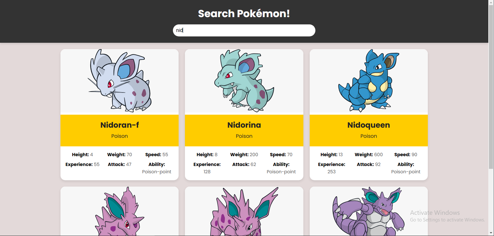

# Poké-Finder

Poké-Finder is a simple web application that allows users to search for Pokémon and view detailed information about them. This project uses the PokéAPI to fetch data about Pokémon and dynamically displays it using modern JavaScript techniques.

## Features

- **Search Functionality:** Real-time search for Pokémon by name.
- **Responsive Design:** The app is mobile-friendly and adapts to different screen sizes.
- **Detailed Information:** Displays various details for each Pokémon, including:
  - Name
  - Type
  - Height
  - Weight
  - Speed
  - Base Experience
  - Attack
  - Ability
  - Image
- **Dynamic Rendering:** Renders Pokémon cards dynamically based on API data and search input.

## Technologies Used

- **Frontend:**
  - HTML5
  - CSS3
  - JavaScript (ES6+)
- **API:**
  - PokéAPI (https://pokeapi.co/)

## Project Structure

```
project-folder/
├── index.html                # Main HTML file
├── styles.css                # CSS file for styling
├── App.js                    # Main JavaScript entry point
├── js/
│   ├── FetchPokemon.js       # Fetches Pokémon data from the API
│   ├── DisplayPokemon.js     # Handles displaying Pokémon cards
│   ├── CreatePokemonCard.js  # Creates individual Pokémon card elements
└── README.md                 # Project documentation
```

## Getting Started

Follow the steps below to run the project locally:

### Prerequisites

- A web browser (e.g., Chrome, Firefox, Edge)
- A code editor (e.g., VSCode) if you want to modify the code

### Steps

1. Clone the repository or download the ZIP file.
   ```
   git clone https://github.com/dadhichvansh/poke-finder.git
   ```

2. Navigate to the project folder.
   ```
   cd poke-finder
   ```

3. Run using Live server extension.

4. Enjoy searching for your favorite Pokémon!

## How It Works

1. The application fetches a list of Pokémon from the PokéAPI when it loads.
2. Each Pokémon is displayed as a card containing its details and image.
3. The search functionality filters Pokémon in real time based on the input.
4. The loading indicator is shown while fetching data.

## Screenshots


*Example screenshot of the application*

## Future Enhancements

- Add pagination to handle larger datasets.
- Allow searching by additional attributes (e.g., type, ability).
- Include sorting and filtering options (e.g., by speed or attack).

## Contributing

Contributions are welcome! Please feel free to submit a pull request or open an issue if you have suggestions or bug reports.

## License

This project is licensed under the MIT License. See the [LICENSE](LICENSE) file for details.

## Acknowledgments

- **PokéAPI:** For providing the data.
- **Google Fonts:** For the Poppins font.

---

Enjoy exploring the world of Pokémon with Poké-Finder! ✨
